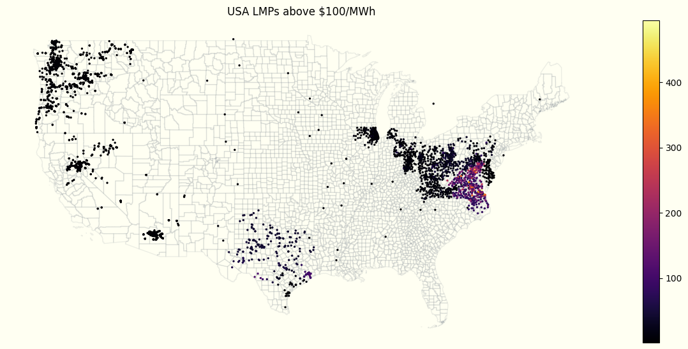
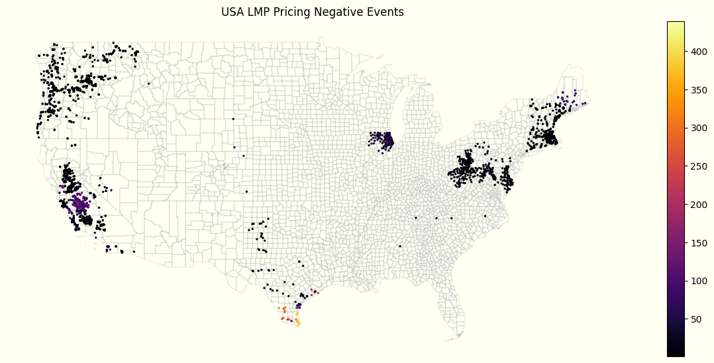
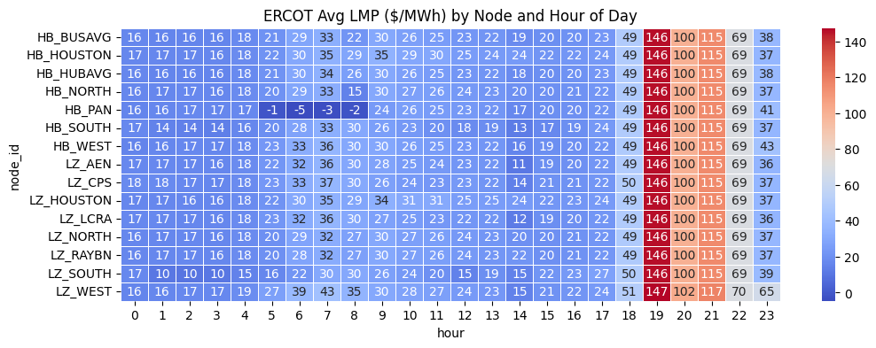

# US Electricity Pricing
Purpose of this effort is to unify datasets across seven different ISOs in order to track and visualize LMP trends across the United States. 

Generally, real-time ISO Energy data exists in Silos. This repository aims to walk through the process of unifying data sets for further analyis. 

## ISOs
[PJM](https://dataviewer.pjm.com/dataviewer/pages/public/lmp.jsf) 
- US States Covered: Delaware, Illinois (partial), Indiana (partial), Kentucky (partial), Maryland, Michigan (partial), New Jersey, North Carolina (partial), Ohio, Pennsylvania, Tennessee (partial), Virginia, West Virginia, and the District of Columbia

[ERCOT](https://www.ercot.com/content/cdr/contours/rtmLmp.html)
- US States Covered: Texas (about 90% of the state's electric load)

[CAISO](https://www.caiso.com/todays-outlook/prices)
- US States Covered: California and small portions of Nevada

[MISO](https://www.misoenergy.org/markets-and-operations/real-time--market-data/market-reports/#nt=%2FMarketReportType%3AReal-Time%2FMarketReportName%3AReal-Time%20Pricing%20Report%20(xls)&t=10&p=0&s=MarketReportPublished&sd=desc)
- US States Covered: Arkansas (partial), Illinois (partial), Indiana (partial), Iowa, Kentucky (partial), Louisiana, Michigan, Minnesota, Mississippi, Missouri (partial), Montana (partial), North Dakota (partial), South Dakota (partial), Texas (partial), Wisconsin

[SPP](https://pricecontourmap.spp.org/pricecontourmap/)
- US States Covered: Arkansas (partial), Iowa (partial), Kansas, Louisiana (partial), Minnesota (partial), Missouri (partial), Montana (partial), Nebraska, New Mexico (partial), North Dakota (partial), Oklahoma, South Dakota (partial), Texas (partial), Wyoming (partial)

[NYISO](https://www.nyiso.com/real-time-dashboard)
- US States Covered: New York

[ISO-NE](https://www.iso-ne.com/isoexpress/)
- US States Covered: Connecticut, Maine, Massachusetts, New Hampshire, Rhode Island, Vermont

# Figures

# Locational Marginal Pricing (LMP) Explained
- LMP can be quickly defines as the marginal cost to provide the next MW of Load at a *specific location* in the electric grid. 
