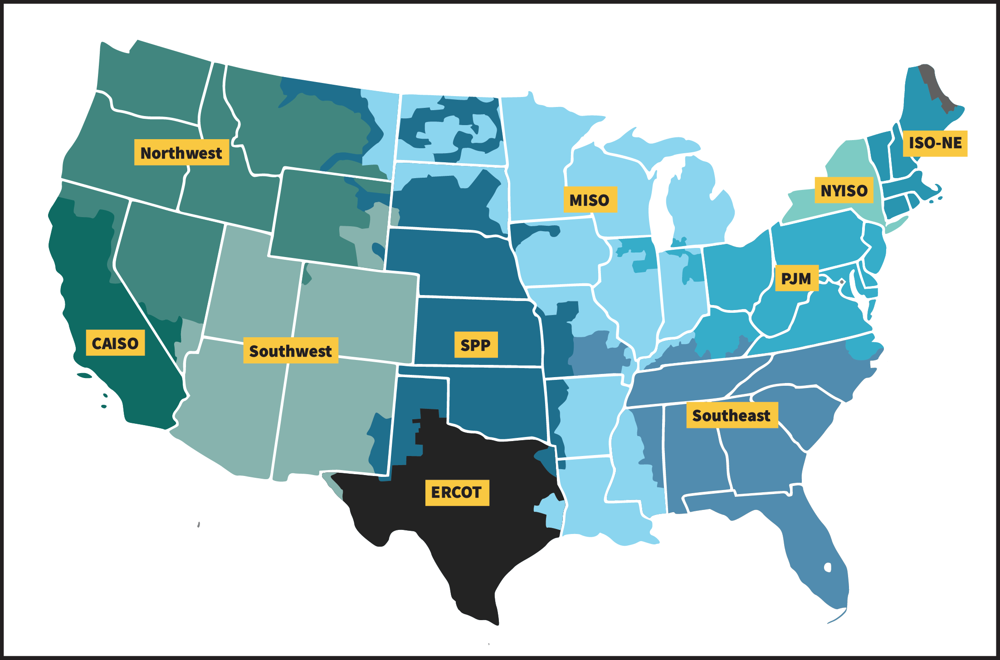
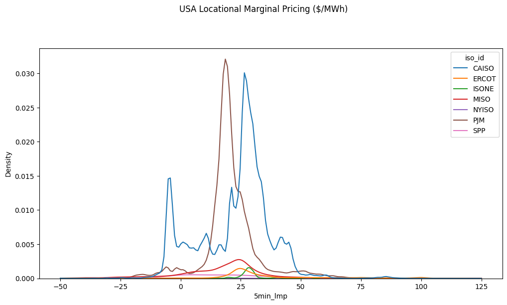
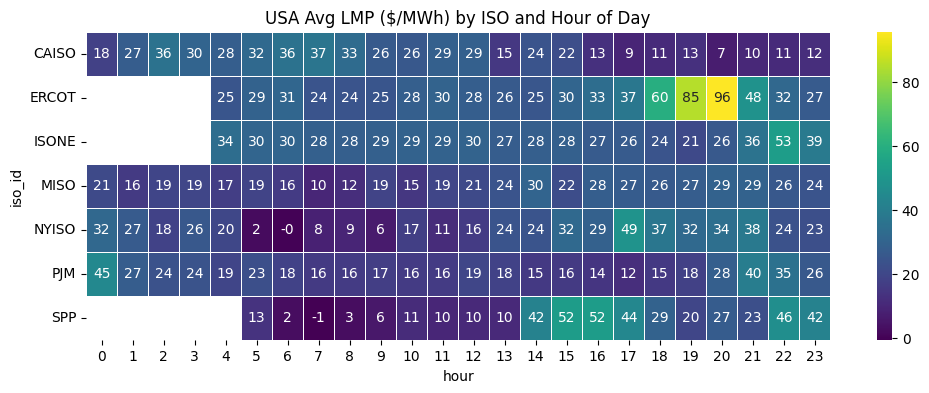

# US Electricity Pricing
Purpose of this effort is to unify datasets across seven different ISOs in order to track and visualize LMP trends across the United States. 

Generally, real-time ISO Energy data exists in Silos. This repository aims to walk through the process of unifying data sets for further analyis. 

**Data we are unifying:** PJM, ERCOT, CAISO, MISO, SPP, NYISO, and ISONE

## Step by Step Guide
1. [Pulling ISO Data](pull_lmp_data.py): The purpose of this python script is to automate the pulling of Locational Marginal Pricing data at the 5 minute interval for the 7 ISOs 
2. [Transforming/Unifying ISO Data](transform_lmp_data.py): The purpose of this python script is to filter, clean and transform data columns so that we can merge all 7 ISO datasets for the given time periods into *one* master dataset. 
4. [Visualizing Unified ISO Data](visualize_lmp_data.py): Visualizing functions fall under two categories:
    - Category #1: Visualizing Functions that allow user to create multiple plots and compare data across ISOs.
    - Category #2: Visualizing functions that allow user to generate single plots that compare data across ISOs.

# US Electric Grid Explained
- Independent System Operators (ISOs) operate a competitive wholesale electricity market and manage the reliability of its transmission grid. 

### ISO and States Covered
[PJM](https://dataviewer.pjm.com/dataviewer/pages/public/lmp.jsf) -- US States Covered: Delaware, Illinois (partial), Indiana (partial), Kentucky (partial), Maryland, Michigan (partial), New Jersey, North Carolina (partial), Ohio, Pennsylvania, Tennessee (partial), Virginia, West Virginia, and the District of Columbia

[ERCOT](https://www.ercot.com/content/cdr/contours/rtmLmp.html) -- Texas (about 90% of the state's electric load)

[CAISO](https://www.caiso.com/todays-outlook/prices) --  California and small portions of Nevada

[MISO](https://www.misoenergy.org/markets-and-operations/real-time--market-data/market-reports/#nt=%2FMarketReportType%3AReal-Time%2FMarketReportName%3AReal-Time%20Pricing%20Report%20(xls)&t=10&p=0&s=MarketReportPublished&sd=desc) -- Arkansas (partial), Illinois (partial), Indiana (partial), Iowa, Kentucky (partial), Louisiana, Michigan, Minnesota, Mississippi, Missouri (partial), Montana (partial), North Dakota (partial), South Dakota (partial), Texas (partial), Wisconsin

[SPP](https://pricecontourmap.spp.org/pricecontourmap/) -- US States Covered: Arkansas (partial), Iowa (partial), Kansas, Louisiana (partial), Minnesota (partial), Missouri (partial), Montana (partial), Nebraska, New Mexico (partial), North Dakota (partial), Oklahoma, South Dakota (partial), Texas (partial), Wyoming (partial)

[NYISO](https://www.nyiso.com/real-time-dashboard) -- US States Covered: New York

[ISO-NE](https://www.iso-ne.com/isoexpress/) -- US States Covered: Connecticut, Maine, Massachusetts, New Hampshire, Rhode Island, Vermont

# Locational Marginal Pricing (LMP) Explained
- LMP can be quickly defined as the marginal cost to provide the next MW of Load at a *specific location* in the electric grid. 
- Functioning like a stock market for electrons, LMP price data can provide us with insights on many aspects of the grid ranging from supply/demand imbalances to grid reliability to potential opportunities for the development of energy systems

# Mini Case Study: Analyzing 1 Day Worth of Data (May 17, 2025)
## Please refer to [this notebook](unifying_data_silos.ipynb) if you would like to deep dive into the code and process that informed this quick analysis

## Takeaways
- There is a portion of CAISO LMP pricing ($/MWh) that falls at or below $0/MWh.
- For the day under analysis, ISONE experienced robust pricing at ~$25/MWh for the day

- Generating a mapping of average hourly LMP by ISO and Hour allows us to get a better view of what the electric market looks like. Of note, we observe stable pricing until about 5PM, which aligns with the end of the workday, a time period where alot of energy is being consumed as people go home and leave work.

# Figures

# Disclaimer!
- Geospatial Data efforts currently fall under another project I am working on. Moreover, I am not entirely sure whether I can publish LMP coordinate data and thus I can only supply these generated data figures. I am more than happy to walk through how my efforts have allowed me to find and extract LMP coordinates. 
- A large portion of the code used in this project falls unders files that are not pushed to this repository. However, upon request (aangelsalazarr@gmail.com), I am more than happy to share hidden code. Hidden code includes the following: 
    - Files containing dictionaries that inform data pull functions 
    - Files containing data pull functions for each ISO
- Datasets are also not pushed to this repository given their size (git limits file pushes to ~30MB). I am more than happy to send over datasets, which are organized as follows: 
    - datasets categorized by ISO
    - a master dataset post the unification of ISO datasets

